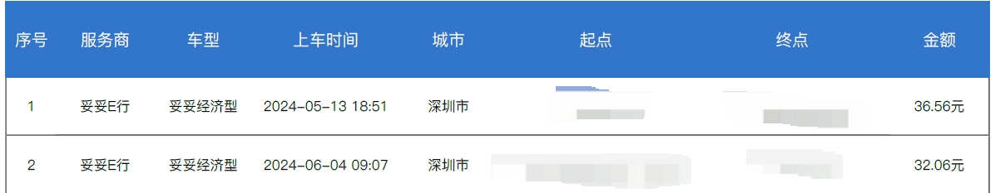
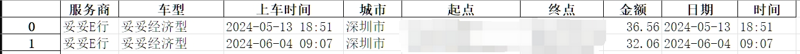

# didi-fapiao
用于将高德app的行程单转变为Excel内容
# 效果
可以将高德app的行程单
​​转变为](6a62c2a7-a593-4ef8-ab48-7aa34af41e80.jpeg)

# 运行方式
在ide工具中
```powershell
git clone https://github.com/FAKE0704/didi-fapiao.git
cd .\didi-fapiao\ # windows
# 修改fapiao.py中的文件夹地址
python fapiao.py
```